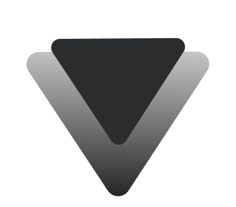

#  
 Hello World... Vitor Queiroz aqui

  
  
  

## 👨🏽‍💻Sobre Mim

  
Sou formado em Tecnologia da informação pelo Instituto Federal da Bahia, e atualmente trabalho na área de Desenvolvimento Web com linguagens, bibliotecas e frameworks como JavaScript, HTML e CSS, Bootstrap, Sass, Node.js, C#, .NET, Figma. Além de possuir requisitos que vão além dos conhecimentos gerais no mundo da tecnologia, possuo um trabalho altruísta, pontual e eficaz, estando sempre disposto reconhecer meus pontos fracos para evolui-los e assim me tornar um profissional mais preparado, e pronto para novos cenários.

  
  

  

 

## ⚙️Tecnologias

 
  
  
  
  
  
  
  
  
  

 

 

## 🛠️Projetos

  
  
  
   
  
  
  

